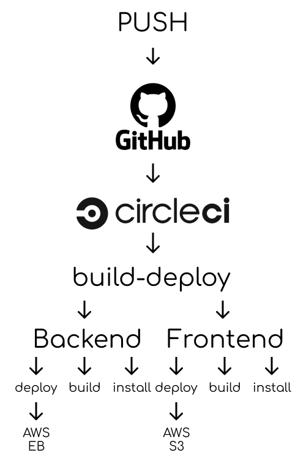

### Circleci :
Before using CircleCi create [package.json](#pipeline)
Main Jobs :
- installing and building and deploying for both the backend and frontend
- AWS configuration

## Pipeline : 
- Setting Env Variables.
- Install NodeJS.
- Checkout Code & Cloning the Repo.
- Install AWS CLI v2.
- Check & Disable AWS pager.
- Configure AWS AccessKeyID.
- Configure AWS Region.
- Frotend :
    - install
    - build
    - deploy
- Backend :
    - install
    - build
    - deploy

